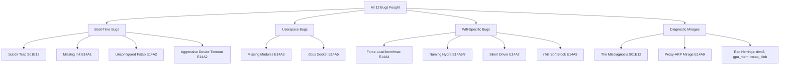

# 🦇 Bestiary

> *Encountered. Documented. Defeated. Catalogued.*

Each entry: symptom (what you see), level (how scary), HP (how hard it was to kill), the trap (why it confuses), the fix.

---

## 🐉 The Misdiagnosis

::: warning Episode: S01E12
**Symptom:** "Pi has no LEDs lit. Must be dead."
**Reality:** Pi Zero 2 W only has ONE LED (green ACT). No red. Off doesn't mean dead.
:::

**Level:** Boss (session-killer)
**HP:** 30 minutes of replacement-ordering panic
**Trap:** Asserting hardware claims from memory without verifying. The board's behavior was *consistent with the truth* — we just had the wrong baseline.
**Fix:** Verify against primary docs before asserting. Saved as [`feedback_fact_check_hardware_claims.md`](#).

---

## 🐉 The Subdir Trap

::: warning Episode: S01E13 (#387)
**Symptom:** Pi appears dead. Solid black, no LED.
**Cause:** `build-rootfs.sh` staged firmware files in a `boot/` subdirectory. Tarball preserved the prefix. SD card ended up with `bootcode.bin` at `/Volumes/BOOT/boot/bootcode.bin` instead of `/Volumes/BOOT/bootcode.bin`.
:::

**Level:** Mid-boss
**HP:** 1 hour (after we identified it)
**Trap:** "It mirrors the Linux mount convention `/boot/firmware/`!" — yes, but the SD's FAT partition has no Linux context. Files go at the root.
**Fix:** Flatten the tarball. Drop the `boot/` subdir from `$FW_STAGE`. See [E13](./e13-bootcode-at-the-root).

---

## 🐉 The Missing Init

::: warning Episode: S01E14 Arc 1 (#388)
**Symptom:** Kernel boots, then green LED freezes. No further activity.
**Cause:** `/sbin/init` doesn't exist in the rootfs. Kernel panics "No working init found." A panicked kernel leaves GPIO state frozen → LED stays in whatever state.
:::

**Level:** Boss
**HP:** 2 hours (didn't initially suspect this)
**Trap:** `debootstrap --variant=minbase` strips `Priority: important` packages, which **includes systemd**. minbase = "just barely Debian, no init system."
**Fix:** Add `systemd-sysv` to `--include`. Also add the rest of the essentials: `openssh-server, wpasupplicant, ifupdown, isc-dhcp-client, dbus, rfkill, net-tools, kmod, ca-certificates, parted, e2fsprogs`.

---

## 🐉 The Unconfigured Fstab

::: warning Episode: S01E14 Arc 2 (#388)
**Symptom:** Pi boots fully but `/boot` is empty. `rc.local` can't find its trigger marker. Firstboot never fires.
**Cause:** `/etc/fstab` is the debootstrap default: `# UNCONFIGURED FSTAB FOR BASE SYSTEM`. No FAT partition gets mounted.
:::

**Level:** Mini-boss
**HP:** 30 minutes
**Trap:** Easy to assume fstab is one of those "Debian Just Has It" defaults. Not on minbase.
**Fix:** Write a real fstab:
```fstab
proc            /proc           proc    defaults                                   0  0
/dev/mmcblk0p1  /boot/firmware  vfat    defaults,flush,nofail                      0  0
/dev/mmcblk0p2  /               ext4    defaults,noatime,errors=remount-ro         0  1
```
Mount FAT at `/boot/firmware/` — Bookworm convention. apt upgrades break with `/boot/`.

---

## 🐉 The Missing Modules

::: warning Episode: S01E14 Arc 3 (#388)
**Symptom:** Kernel boots, init runs, but no wifi. `mmc1: new high speed SDIO card at address 0001` appears in journal and then **nothing** — no `brcmfmac:` probe.
**Cause:** Kernel modules are in `/tmp/fw/modules/<release>/` in the firmware tarball. Our script extracted the kernel and dtb to the BOOT partition but forgot to copy the modules tree into `/lib/modules/<release>/` of the rootfs.
:::

**Level:** Mid-boss
**HP:** 1 hour
**Trap:** "If the kernel boots, modules must work" — no. The kernel boots, but without `/lib/modules/<release>/`, modprobe can't load anything.
**Fix:** Copy `/tmp/fw/modules/*-v8+/` → `$ROOTFS_MNT/lib/modules/`. Make sure the version matches the kernel image you ship.

---

## 🐉 The Aggressive Device Timeout

::: warning Episode: S01E14 Arc 2 (sub-bug, #388)
**Symptom:** `/dev/mmcblk0p1 device timeout` after 5 seconds. `/boot` never mounts. `rc.local` triggers but its marker check fails.
**Cause:** Our fstab had `x-systemd.device-timeout=5s`. Default is 90 seconds. The kernel *had* enumerated p1, but systemd-udev hadn't created the device node within 5 seconds.
:::

**Level:** Minor
**HP:** 15 minutes
**Trap:** Aggressive optimizations hide real failures. "I set the timeout low so I find problems faster" → you find phantom problems.
**Fix:** Remove the timeout override. Default 90s is fine.

---

## 🐉 The dbus Socket

::: warning Episode: S01E14 Arc 5 (#388)
**Symptom:** `wpa_supplicant: dbus: Could not acquire the system bus`. wpa_supplicant.service fails with status 255/EXCEPTION.
**Cause:** `wpasupplicant` package only **recommends** dbus. `--no-install-recommends` (implicit in apt invocation) skipped it.
:::

**Level:** Minor
**HP:** 20 minutes
**Trap:** "Recommends" sounds optional. For systemd-managed services, it's often load-bearing.
**Fix:** Add `dbus` explicitly to `--include`.

---

## 🐉 The Naming Hydra

::: warning Episode: S01E14 Arcs 6-7 (#388)
**Symptom:** `Direct firmware load for brcm/brcmfmac43430-sdio.bin failed with error -2`. Then later: firmware "loads" (no error message) but chip stays in `HT Avail timeout`.
**Cause:** Pi Zero 2 W's wifi chip has multiple official names:

| Name | Source |
|---|---|
| BCM43436 | Pi Foundation marketing |
| BCM43430 | brcmfmac driver (chip-family register) |
| CYW43436s | Cypress (silicon vendor), with `s` suffix for rev 1.0 |
| cyfmac43430 | Debian's `firmware-brcm80211` filename |

Each tool/distro/firmware naming is slightly different. The right filename and the right blob (rev-specific) must both align.
:::

**Level:** Final boss
**HP:** 6+ hours (multiple firmware swaps, symlink chains, nvram experiments)
**Trap:** Each name "feels close" so you assume close-enough is enough. It isn't. A `43436` blob loaded into a chip that wants `43430b0` initializes the wrong PLL config → HT clock never grants.
**Fix:** **Stop hand-picking filenames.** Use Pi Foundation's `firmware-brcm80211` from `archive.raspberrypi.com/debian`. It ships the right blobs under the right names, with the right symlinks. apt resolves the rev.

---

## 🐉 The Silent Driver

::: warning Episode: S01E14 Arc 7 (#388)
**Symptom:** brcmfmac firmware loads cleanly. `brcmf_c_preinit_dcmds: Firmware: BCM43430/1 wl0:` appears. Then nothing. No `wlan0:` interface registration.
**Cause:** Kernel↔modules version skew. We had kernel `6.12.75-v8+` from `raspberrypi/firmware` tarball, but the module probe path was looking for a different version. Driver entered an internal failure path that didn't log anything.
:::

**Level:** Final boss (silent phase)
**HP:** 3 hours of staring at journal
**Trap:** Silent failures are the worst kind. You can't grep for errors that don't exist.
**Fix:** Use the apt-installed kernel (`linux-image-rpi-v8`) + matching modules. apt resolves the match automatically.

---

## 🐉 rfkill Soft Block

::: warning Episode: S01E14 Arc 9 (#388)
**Symptom:** `wlan0` registered, country set to PT, wpa_supplicant initialized. But `dhclient` fails: `send_packet: Network is down`.
**Cause:** The Pi kernel boots with wifi rfkill **soft-blocked by default** (regulatory protection). Setting country in `wpa_supplicant.conf` doesn't automatically unblock — Pi OS unblocks via `raspi-config do_wifi_country`. Without raspi-config, the radio stays muted.
:::

**Level:** Mini-boss
**HP:** 45 minutes (after we suspected wifi was working but something was suppressing TX)
**Trap:** The journal logs *one warning* (`rfkill: WLAN soft blocked`) and then proceeds as if nothing's wrong. wpa_supplicant doesn't fatally error. dhclient just times out.
**Fix:** Drop a oneshot systemd unit:
```ini
[Unit]
Description=Nosferato — unblock wifi rfkill at boot
DefaultDependencies=no
Before=network-pre.target wpa_supplicant.service ifupdown-pre.service
After=local-fs.target
[Service]
Type=oneshot
ExecStart=/usr/sbin/rfkill unblock all
RemainAfterExit=yes
[Install]
WantedBy=sysinit.target
```

---

## 🐉 The Proxy-ARP Mirage

::: warning Episode: S01E14 Arc 9 sub-boss
**Symptom:** `ping -c 1 172.20.10.X` succeeds for **all** 13 IPs in an iPhone hotspot subnet. Looks like every address is alive.
**Cause:** iPhone hotspot proxy-ARPs the entire `/28` subnet, responding to ARP for all 13 IPs with its own MAC. ICMP always succeeds.
:::

**Level:** Minor (red herring)
**HP:** 5 minutes
**Trap:** ICMP-ping isn't reliable for host discovery on iPhone hotspots.
**Fix:** TCP-scan port 22 instead. `nc -z -w 2 <ip> 22` or `bash -c "echo > /dev/tcp/<ip>/22"`. Only the host with sshd listening responds.

---

## 🐉 The False Lead — dtoverlay=dwc2

::: warning Episode: S01E14 Arc 6 (sub-investigation)
**Symptom:** Suspected this overlay was interfering with wifi.
**Reality:** dwc2 switches USB controller mode (host ↔ gadget). Has zero effect on SDIO/wifi.
:::

**Level:** Red herring
**HP:** 20 minutes (mostly to disprove)
**Trap:** When you can't identify the bug, anything unfamiliar in `config.txt` becomes a suspect.
**Fix:** Don't fix what isn't broken. Document why you considered and dismissed it. Move on.

---

## Family taxonomy



## Key insight

**8 of the 12 bugs would have been prevented by `apt install`.** Only the misdiagnosis (E12), the FAT root bug (E13), and the proxy-ARP mirage were unavoidable. The rest was friction from doing kernel-firmware-modules integration that Pi Foundation already does for you.

→ [The Recipe](/nosferato/recipe/) — the apt-based shortcut that skips all of these.
