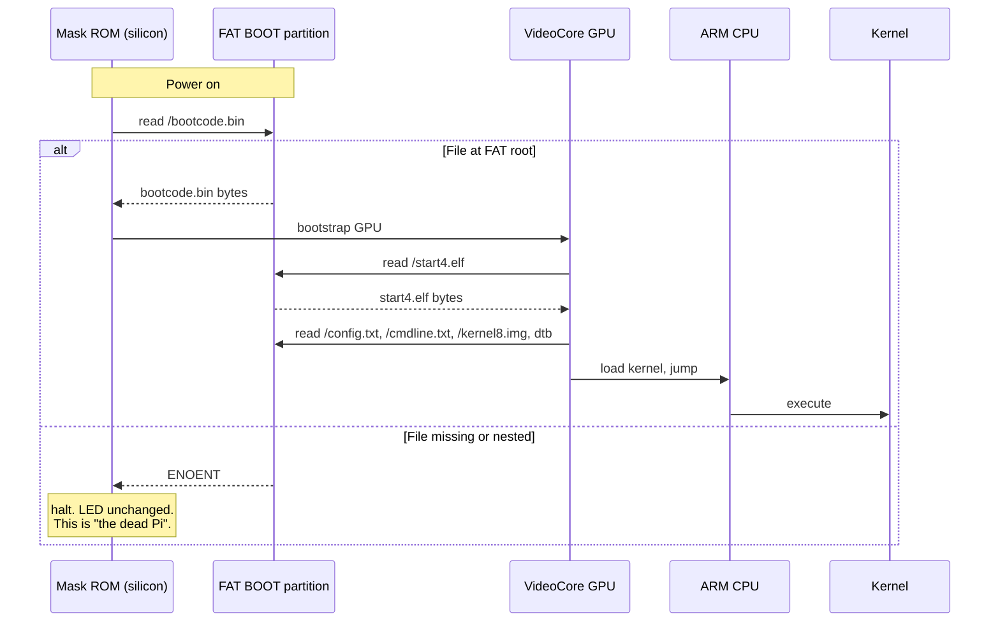

# 🦇 S01E13 — Stage One, Where Art Thou?

> *the boot loader is a strict landlord. file in wrong room? eviction. no notice. no recourse.*

::: tip TL;DR
The Pi Zero 2 W has **no EEPROM bootloader** — unlike the Pi 4/5, it loads `bootcode.bin` directly from the SD card via mask-ROM. The mask-ROM reads from the **root** of the FAT partition. Our `build-rootfs.sh` nested everything in a `boot/` subdir. Stage 1 failed silently. Black silicon. Fix: flatten the tarball, lay all firmware files at FAT root.
:::

## The setup

Pi family bootloaders:

| Model | Stage-1 source |
|---|---|
| Pi 1, 2, 3 (BCM2835/2836/2837) | SD card FAT root → `bootcode.bin` |
| **Pi Zero 2 W (BCM2837 / RP3A0)** | **SD card FAT root → `bootcode.bin`** |
| Pi 4 (BCM2711) | EEPROM (with SD fallback) |
| Pi 5 (BCM2712) | EEPROM |

The Pi Zero 2 W sits in the *legacy* camp. If `bootcode.bin` isn't at the FAT root, the mask-ROM has nothing to chain to. The chip just sits there silently.

## The crime scene

`build-rootfs.sh` line 122 (original):

```bash
FW_STAGE=/tmp/nosferato-fw
rm -rf "$FW_STAGE" && mkdir -p "$FW_STAGE/boot"  # ← creates boot/ subdir
```

Then files copied into `$FW_STAGE/boot/bootcode.bin`, etc.

Line 160:

```bash
tar czf /mnt/shared/boot.tgz boot/  # ← tarball with boot/ as top-level
```

Then `build.sh` step 4:

```bash
tar xzf "$SHARED_DIR/boot.tgz" -C "$BOOT_STAGE"  # extracts as boot-stage/boot/...
```

Step 8:

```bash
cp -R "$BOOT_STAGE/." "$BOOT_MOUNT/"  # preserves boot/ on SD
```

Result on the SD's FAT partition: `/Volumes/BOOT/boot/bootcode.bin`. The mask-ROM looks at `/Volumes/BOOT/bootcode.bin` — not there → boot fails → no LED activity → looks dead.

## Boss fight: how do we know?

**Empirical evidence:** PINN's working SD card has all firmware files at the FAT root (no `boot/` subdir). We could compare directly:

```bash
$ ls /Volumes/RECOVERY/ | head -10
bcm2708-rpi-b-plus.dtb
bcm2710-rpi-zero-2-w.dtb     # ← at root
bootcode.bin                  # ← at root
config.txt                    # ← at root
kernel8.img                   # ← at root
start4.elf                    # ← at root
...
```

**Authoritative confirmation:** Kali ARM's `raspberry-pi-zero-2-w.sh` uses the `raspi-firmware` Debian package, which puts files at `/boot/firmware/` (which is the FAT partition's mount path on Bookworm, files appearing at the partition's root).

**Mainline Debian's `raspi-firmware` package** confirms the same — staged at `/usr/lib/raspi-firmware/`, copied by `flash-kernel` to the mount point at FAT root.

So three independent sources agree: **FAT root**. Our nested subdir was the anomaly.

## The fix

Seven-line patch in `build-rootfs.sh`:

```diff
- mkdir -p "$FW_STAGE/boot"
+ mkdir -p "$FW_STAGE"

- cp -v bootcode.bin start*.elf fixup*.dat "$FW_STAGE/boot/"
+ cp -v bootcode.bin start*.elf fixup*.dat "$FW_STAGE/"

- cp -v bcm2710-rpi-zero-2-w.dtb "$FW_STAGE/boot/"
+ cp -v bcm2710-rpi-zero-2-w.dtb "$FW_STAGE/"

- mkdir -p "$FW_STAGE/boot/overlays"
+ mkdir -p "$FW_STAGE/overlays"

- cp -v overlays/dwc2.dtbo ... "$FW_STAGE/boot/overlays/"
+ cp -v overlays/dwc2.dtbo ... "$FW_STAGE/overlays/"

- cp -v kernel8.img "$FW_STAGE/boot/"
+ cp -v kernel8.img "$FW_STAGE/"

- tar czf /mnt/shared/boot.tgz boot/
+ tar czf /mnt/shared/boot.tgz .  # flat tarball
```

→ Commit [`ef0aa1f`](https://github.com/code-hartle-tech/neartrace-android-mvp/commit/ef0aa1f)

## Boot sequence diagram



## Bonus: ALSO confirmed the user's hypothesis

User's exact words during E12:

> *"whatever the OS partition does wouldn't stop the Pi from booting if the BOOT partition is done correctly."*

Truth. Boot stages 1-4 are independent:

| Stage | Failure mode | LED behavior |
|---|---|---|
| 1 — mask-ROM → bootcode.bin | File missing at FAT root | LED never lights |
| 2 — bootcode.bin → start.elf | start.elf missing | LED never lights |
| 3 — start.elf → kernel | kernel8.img missing | brief LED flash then off |
| 4 — kernel → init (rootfs mount) | rootfs broken | LED flashes during read attempts, then settles |

"**Completely dark**" = stage 1 failure = BOOT partition issue. **Always**. (We didn't know this at the time.)

## The bigger lesson

The whole `build-rootfs.sh` followed a "stage everything under a tree that mirrors the Linux mount path" mental model. That model is right for `apt install raspi-firmware` (which gets unpacked under `/boot/firmware/`) but wrong for raw SD card preparation (where the FAT partition's root is what matters). Two different filesystems, two different conventions.

→ [Saved as recipe insight](/nosferato/recipe/)

## Final scene

```
$ diskutil mount /dev/disk4s1
$ ls /Volumes/BOOT/
bootcode.bin              # ← at root, finally
kernel8.img               # ← at root
bcm2710-rpi-zero-2-w.dtb  # ← at root
overlays/                 # ← at root (subdir, but at root)
config.txt
cmdline.txt
```

User: *"led blinked, then stayed on (its still on), no connection."*

LED activity. Stage 1 passed. The mask-ROM did its job, kernel loaded. **Now**, what's wrong with the kernel?

→ [**Next: E14 — Fourteen Hours in the Forest**](./e14-whack-a-mole)

## Source links

- [Raspberry Pi documentation — bootloader](https://www.raspberrypi.com/documentation/computers/raspberry-pi.html)
- [Kali ARM build scripts (uses `raspi-firmware` apt package)](https://gitlab.com/kalilinux/build-scripts/kali-arm/-/blob/main/raspberry-pi-zero-2-w.sh)
- [Debian `raspi-firmware` package file list](https://packages.debian.org/bookworm/all/raspi-firmware/filelist)
- [#387 — bootcode.bin must live at FAT root (closed)](https://github.com/code-hartle-tech/neartrace-android-mvp/issues/387)
- Commit [`ef0aa1f`](https://github.com/code-hartle-tech/neartrace-android-mvp/commit/ef0aa1f)
